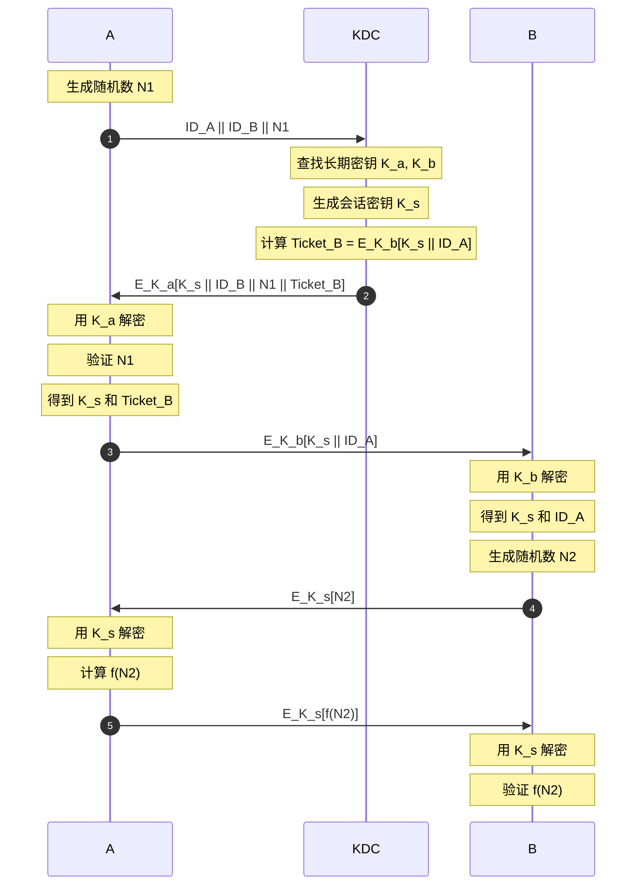

---
{"dg-publish":true,"permalink":"/z-auth/au-base/","dgPassFrontmatter":true}
---


# 安全分析

## 非形式化

### 攻击及其防御

| Name    |                          | 描述             |     |
| ------- | ------------------------ | -------------- | --- |
| 中间人攻击   | man-in-the-middle attack | 截获公开信道后发送自己的消息 |     |
| 口令猜测攻击  | Password guessing attack |                |     |
| 验证器被盗攻击 | Stolen Verifier          |                |     |
| 冒充攻击    | Impersonation Attack     | 模拟公开信道的        |     |
| 前向安全    | Forward secrecy          |                |     |
|         |                          |                |     |

#### Defense against man-in-the-middle attack


## 形式化

### 查询

> [!NOTE] 结论1
> $Adv^{ftg}(t,send,reveal,exe)\leq2\cdot Adv^{ror}(t,send,test,exe)$
> $q_{test}=q_{reveal}+1$


$I:代表所有实体（U∪S∪XX）$


> [!NOTE] Execute：输出实体间真实交互的消息
> - （C, S）（BPR）: 模拟攻击者<mark style="background: #FF5582A6;">窃听</mark> C，S 间真实执行 


> [!NOTE] Send：输出 U 接受到 m 后生成的消息
> - （U, m）（BPR）：模拟主动攻击，攻击者可<mark style="background: #FF5582A6;">拦截消息并对其进行修改、伪造新消息</mark>， 或将其直接转发给目标参与方。


- $Succ_{n}:\mathcal{A}成功在Test-query中猜测比特b$
- 
#### Game

- $Game_{0}:Adv_{p}^{ake}(A)=2Pr[Succ_{0}]-1$(真实)
	- 即$Test-query$
	- $A获得p=a\cdot s+2e,k=p\cdot s$
- $Game_{1}:|Pr[succ_{1}]-Pr[succ_{0}]|\leq \epsilon$
	- $Hash-query$
		- 在$Game_{6}$中出现
- $Game_{1}:$(随机)
	- $C设置p=b,k=p\cdot s$
	- 0,1：$A可区分rlwe实例$
- $Game_{2}:$
	- $C设置x=b\to k=p$

- $Game_{7}:$


### Security definitions 安全定义

> [!NOTE] Partnering：会话标识符（sid）和伙伴标识符（pid）
>- ROR：sid：某个会话。 Pid：对等实体。则若满足以下条件，则称两个实例U1和U2为伙伴：（1） U1与 U2均接受；（2） U1与 U2具有相同的会话标识符；（3） U1的伙伴标识符为 U2且反之亦然；（4）除 U1与 U2之外，没有其他实例以等于U1或 U 2的伙伴标识符接受。实际上，sid可以取为客户端和服务器实例在接受之前对话的部分记录。

- Semanticsecurity语义安全
	- 认证协议目的：会话密钥安全
		- 一个协议$P$中，$A$多项式时间内可执行$Execute,Send,Reveal\dots$和一次$Test$.
			- 游戏结束时输出$b$
		- 
---
- 


## 工具


# Scyther
#Scyther-base
```
python scyther-gui.py protocol.spdl

python scyther-gui.py --no-splash protocol.spdl
```
## 语言

### 角色
协议由角色定义，角色由事件定义

```
protocol ExampleProtocol(I,R) {
role I { };
role R { };
};
```
- 最小输入
在上面，我们定义了一个名为“ExampleProtocol”的协议，它有两个角色“I”和“R”，它们列在协议名后的括号中。请注意，我们还没有定义这些角色的行为：这类行为是在相应的 role I 和 role R 命令后的花括号内定义的。

### term
#### 原子项
- string
原子项可以通过 配对 和 加密 等运算符合成复杂项

####  常量
```
role X(...) { fresh Na: Nonce; send_1(X,Y,Na); }
```
- 常量 常量名 类型
#### 变量
```
role Y(...) { var Na: Nonce; recv_1(X,Y,Na); }
```
- 变量 变量名 类型

- 常量、变量均由角色定义

### 配对
- 任意两个项可以配对
	- $(x,y),((x,y),z)\dots$
#### 对称密钥
- 任何term可以作为s-k
```
{ ni }kir
```
- s-k kir对ni进行加密
#### 非对称
```
{ ni }pk(I)
```
### 哈希函数
```
hashfunction H1;
H1(ni)
```
### 预定义类型

### 用户类型
```
usertype MyAtomicMessage;
protocol X(I,R) {
role I {
var y: MyAtomicMessage;
recv_1(I,R, y );
```
这种声明的效果是：新类型的变量只能用该类型的消息 m 来实例化，即通过全局声明 const m: MyAtomicMessage 或在某个角色内新生成的 fresh m: MyAtomicMessage 所声明的消息。

### 事件


#### 声明即安全属性
- recv 和 send 事件分别标记接收消息和发送消息。
```
role MyRole(...) { recv_Label1(OtherRole, MyRole, m1); send_Label2(MyRole, OtherRole, m2); }
以指定角色 MyRole 先从 OtherRole 接收消息 m1，然后再向 OtherRole 发送消息 m2。接收事件的标签是 Label1，发送事件的标签是 Label2。
role MyRole(...) { send_Label3(MyRole, OtherRole, m2); } role OtherRole(...) { recv_Label3(MyRole, OtherRole, m2); }
```
- 声明事件用于角色规范中，以建模预期的安全属性。例如，下面的声明事件表明 Ni 应当是保密的。
```
claim(I, Secret, Ni);
```


## Needham-Schroede
#Needham-Schroede
[Needham-Schroeder协议原理及实现(Java)-CSDN博客](https://blog.csdn.net/qq_41115702/article/details/105884123)



```
protocol ns3(I,R) { 
role I { 
fresh ni: Nonce; var nr: Nonce; 

send_1(I,R, {I,ni}pk(R) );
recv_2(R,I, {ni,nr}pk(I) ); 
claim(I,Running,R,ni,nr); 
send_3(I,R, {nr}pk(R) ); 

claim_i1(I,Secret,ni); 
claim_i2(I,Secret,nr); 
claim_i3(I,Alive); 
claim_i4(I,Weakagree); 
claim_i5(I,Commit,R,ni,nr); 
claim_i6(I,Niagree); 
claim_i7(I,Nisynch); } 

role R { 
var ni: Nonce; fresh nr: Nonce; 

recv_1(I,R, {I,ni}pk(R) );
claim(R,Running,I,ni,nr); 
send_2(R,I, {ni,nr}pk(I) ); 
recv_3(I,R, {nr}pk(R) ); 

claim_r1(R,Secret,ni); 
claim_r2(R,Secret,nr); 
claim_r3(R,Alive); 
claim_r4(R,Weakagree); 
claim_r5(R,Commit,I,ni,nr); 
claim_r6(R,Niagree); 
claim_r7(R,Nisynch); } }
```


